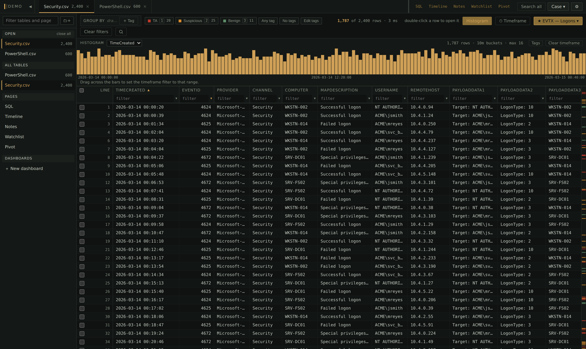
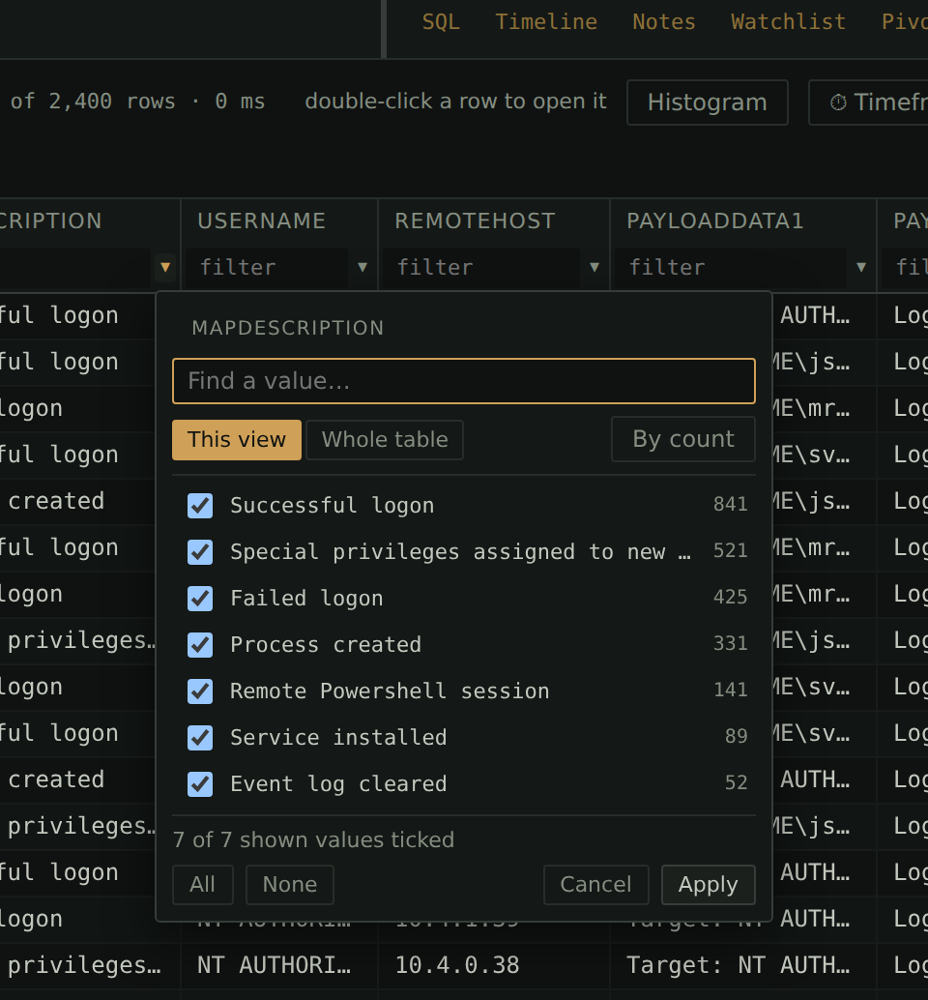
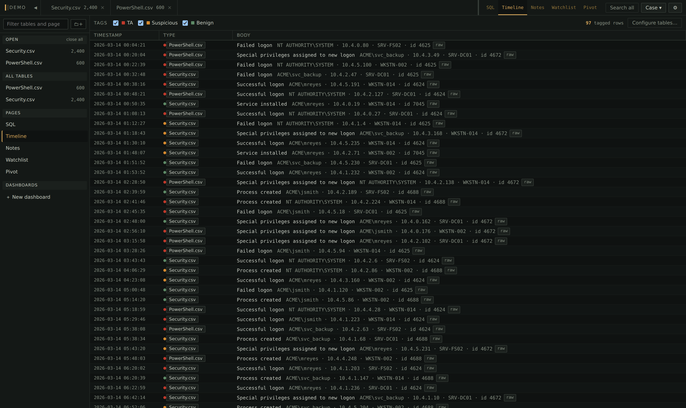
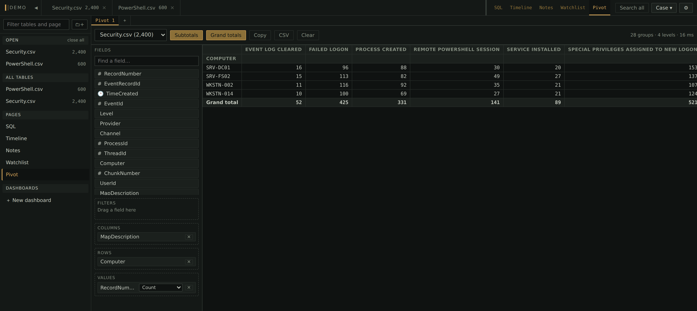

# Winnow

**A fast, local viewer for the enormous CSVs that DFIR triage produces** —
EvtxECmd, MFTECmd, Amcache, the whole KAPE output folder — with the
row-tagging workflow that turns a million log lines into a findings list.
Think Timeline Explorer, rebuilt for big files: a 1.2-million-row CSV
imports in ~8 seconds, filtering it takes milliseconds, and scrolling never
stutters no matter how deep you are.



Everything runs on your machine — one Python server, no cloud, no build
step, works on an airgapped analysis box. Your work (tags, notes, saved
views, the watchlist) lives in a single SQLite case file you can hand to
another analyst. The evidence files themselves are **never modified**.

## What you get

- **Tags with hotkeys** — press `1` to mark a row TA, `2` suspicious. Tag
  counts live in the ribbon, a rail down the grid's edge shows where your
  findings cluster in the whole filtered view, and undo steps back through
  exactly what each tag operation changed.
- **Filters that keep up with you** — type `4624` or `!svchost` or `>1000`
  straight into a column header, pick values Excel-style from the header
  dropdown, or build AND/OR trees in the guided builder. **Ready-made
  triage filters ship in the box** (logon sweeps, RDP both directions,
  Defender tampering, persistence run keys, …) and appear automatically
  when a matching table opens.
- **Time navigation** — pin a timeframe that survives every filter change,
  jump to the same timestamp across tables, derive real sortable datetime
  columns from epochs/FILETIME/Excel serials/whatever your tool emitted.
- **Case-wide pages** — a unified Timeline of everything you've tagged, an
  IOC watchlist scanned across every table, Markdown case notes that link
  back into the evidence, and named dashboards (a ready-made KAPE triage
  profile included).
- **Plaso timelines** — drop a `.plaso` file in and the whole log2timeline
  output lands as one flat, filterable table. No plaso install needed.
- **Zipped bundles** — drop in an ESXi support bundle or UAC collection
  (`.zip`/`.tar`/`.tgz`/`.gz`) and Winnow expands it, nested archives and
  rotated logs included, then imports the files inside.
- **Pivot tables, session bookends, raw NTFS parsing, ESXi/UAC log
  triage** and more via drop-in plugins (six ship with the app), plus a
  read-only SQL pane when you want to write the query yourself.

## Get started

```bash
pip install fastapi "uvicorn[standard]" python-multipart
python server.py
```

That opens the home screen at http://127.0.0.1:8777 in an **app window** —
no address bar or tab strip, its own taskbar entry — falling back to an
ordinary browser tab if no Chromium-family browser is around. Create a
case, then import files from the UI, drag-and-drop them onto the window,
or skip ahead with `python server.py --case case.db --open timeline.csv`.

Prefer not to touch a terminal? The `launch/` folder has double-click
launchers for Linux, macOS and Windows — see
[launch/README.md](launch/README.md). And **Settings → File associations**
puts Winnow in the OS's Open With menu for the types it reads (per-user,
no admin rights). If the automatic registration doesn't stick — Windows
guards double-click defaults, some Linux desktops cache MIME handlers —
the panel's *"Not working? Set it manually"* section walks through the
manual route and shows the exact command your install registers.

| flag | meaning |
| --- | --- |
| `--case FILE` | SQLite case file, created if missing |
| `--open A.csv B.csv` | Ingest files at startup |
| `--no-fts` | Skip the full-text index — roughly halves import time; search falls back to substring scanning |
| `--port`, `--host` | Defaults 8777 / 127.0.0.1 |
| `--no-browser` / `--browser-tab` | Don't auto-open a window / open a plain tab instead |
| `--force` | Open a case another Winnow still holds |

A case file is meant to be open in **one** Winnow at a time — opening a
case another server holds tells you who has it and asks first. Don't put
case files on a network share: SQLite's journalling doesn't survive
SMB/NFS. Two analysts on one investigation should work in separate case
files and merge with session files. When you're done, the ⏻ button shuts
the server down from the UI; a server whose windows have all been closed
shuts itself down after a couple of idle minutes anyway.

### Updating

Your work lives *inside the Winnow folder* (workspace, plugins, sessions,
often cases), so don't replace the folder — update in place. Nothing in
that list is ever touched, the old version is backed up first, and Winnow
never phones home on its own:

- **From the app:** Settings → Updates → *Check for updates*.
- **From a terminal:** `python update.py --check`, then `python update.py`
  (and `--rollback` to undo).
- **Airgapped:** `python update.py --download-only --dest /media/usb` on a
  connected machine, then `python update.py --from /media/usb/winnow-*.zip`
  on the analysis box.
- **Beta channel:** `python update.py --dev` tracks the develop branch;
  Settings → Updates shows the exact build.

## How fast?

1.2M rows × 10 columns (169 MB CSV), measured on an ordinary laptop:

| | |
| --- | --- |
| Import | 8.2 s (~147k rows/s) |
| Full-text index build | 8.8 s |
| Filter + sort 171k matching rows | 0.6 s |
| Fetch a page 150,000 rows deep | 1 ms |
| Full-text search across all columns | 8 ms |
| Tag all 171k rows in a view | instant |

## Everyday triage



Filters are typed straight into the box under each column header:

| type | means |
| --- | --- |
| `svchost` | contains |
| `!svchost` | does not contain |
| `=4624` | exact |
| `^C:\Users` | starts with |
| `>1000` | greater than (numeric) |
| `/re/` | regular expression |
| `""` / `*` | empty / not empty |
| `a\|b\|c` | any of |

The `▾` on each filter box opens that column's values — every distinct
value with a count, ticked or unticked, like Excel's header dropdown.
Click a column header to sort, `Shift`-click for a secondary sort.
**Right-click** does the obvious thing everywhere: a row (tag, filter to
the cell, copy), a group header (tag the whole group), a column header
(formats, datetime/flatten extraction), a tab or sidebar entry (the table
menu).

The keys you'll actually use — `?` shows the full list, and everything is
rebindable in Settings:

| keys | do |
| --- | --- |
| `↑↓` / `jk`, `g` / `G` | move; jump to top / bottom |
| `1`–`9` | toggle a tag on the selection (`Shift`: on **every** row in view) |
| `Ctrl+Z` | undo the last tag change, step by step |
| `/` | search all columns (substring, regex or advanced) |
| `f` / `F` | filter to the selected cell's value (`F` drops other filters too) |
| `v`, `e` | value picker; filter builder |
| `q` / `w` | cycle the saved filters (also `[` / `]`) |
| `r` / `R` | toggle / configure the timeframe filter |
| `a`, `.` | jump to a timestamp; jump to the same moment in another table |
| `d`, `n` | detail pane; row note |
| `x` / `X` | drop grouping / toggle it off-and-back |
| `t`, `s`, `C` | Tables manager; Search all; table menu |
| `Alt+1`–`0` | switch tabs (`Alt+1` = the table you were last in) |
| `Q` | open the current filter/sort/search as SQL |

Saved filters can carry a grouping, cycle in the order you arrange them,
and the timeframe dialog can fill its range from your tagged rows.

## Grouping

Drag a column header into the **Group by** strip to bucket the view —
counts per value, expand a group for its rows, drag in a second column for
a nested breakdown, reorder by dragging the pills. A datetime column
groups by calendar day. **+ Tag** adds a level that buckets by the tags on
the rows — one group per tag plus everything untagged, nested either way
round. Grouped rows are ordinary rows: select, tag, right-click; a group
header's menu tags or untags the whole group without expanding it.

## Tables, pages and the sidebar

The header bar carries your open tables on the left and the pages — SQL,
Timeline, Notes, Watchlist, anything a plugin adds — on the right. Both
strips reorder by dragging; both kinds of tab close with ✕ (a closed
table stays in the case; a closed page reopens from the sidebar). The
sidebar lists everything — every table open or closed, sortable into
folders, every page, every dashboard — and directory import recreates the
evidence folder tree there automatically.

## The case pages



- **Timeline** — every tagged row across every table, one chronological
  stream. Tag it and it's on the timeline; that's the whole model.
- **Search all** (`s`) — sweep every table in the case, open or closed.
  Paste a list of IOCs one per line and get per-indicator, per-table hit
  counts; a click opens that table filtered to the term.
- **Watchlist** — case-level indicators (hashes, IPs, domains, filenames)
  scanned across every table, with per-indicator hit counts, optional
  auto-tagging, import/export, and a dot on the tab when new hits land.
- **Notes** — a Markdown scratchpad saved in the case file. Links like
  `[the 4624 sweep](winnow:table/3)` navigate to tables, queries and
  dashboards from the preview — the Link ▾ button writes them for you.
- **Dashboards** — named boards of widgets (counts, charts, top-N lists)
  built from templates or your own SQL, with live preview before saving.
  A board plus your enabled plugins saves as a **profile** you can apply
  to the next case of the same type — the shipped **KAPE triage** profile
  is exactly that: logon movement, RDP, tampering signals, registry
  persistence, and a starter watchlist — plus a second **KAPE host
  overview** board (hostname, IPs, domain, OS, role, Sysmon and
  PowerShell logging posture, Security-log coverage, Defender alerts).

## Timestamps

Right-click a column header → **Derive a column from this…** (choose
*Timestamp*) and
Winnow samples the column, suggests a format with a live preview, and adds
a *new*, genuinely sortable datetime column — the original is never
modified. It reads Unix epochs (seconds through nanoseconds), Windows
FILETIME, WebKit/Chrome, Mac absolute, .NET ticks, Excel serials, ISO
8601, US dates with AM/PM, Apache and RFC 2822 dates, and year-less BSD
syslog (you supply the starting year; it rolls over New Year on its own).
Values with an explicit offset convert to UTC; values without one are kept
as written unless you set the source's offset. Unparsable values stay
empty and are counted, with a one-click view of what didn't convert.

Derived columns sort, filter, group, feed the timeframe filter and the
Timeline, and export like any other column (marked `ƒ`). Display format is
separate and presentation-only — the stored and exported value is always
the text the file came with (Settings → Timestamps sets defaults).

## Nested JSON and XML

Logs love to put a whole document in one cell — EVTX `EventData`, cloud
audit `requestParameters`. Double-click a row for the **detail pane**,
where JSON/XML is pretty-printed and every node is addressable:
right-click one and **Add as a column** builds a real column from that
field, no path syntax to learn. **Flatten JSON/XML into columns…** does
the whole document at once — it samples the column, lists every field
with coverage and an example, and builds the ones you tick in a single
pass. Paths read the way you'd expect when you do want to edit one:

| | |
| --- | --- |
| `$.user.name`, `items[0].id` | JSON fields and arrays |
| `Event/System/EventID` | an XML element's text |
| `Provider@Name` | an XML attribute |
| `Data[@Name='LogonType']` | the repeated element with that attribute — why EVTX comes out useful |

The detail pane's right-click also works on highlighted text: copy it,
filter the column to it, exclude it, or search every column for it.

## Sessions and export

**Session → Save session file** writes a small JSON of tag definitions,
assignments, notes, layout and saved views, plus a hash of the source
files — load it against the same evidence elsewhere and it warns on a
mismatch. Tags merge by *name*, so two analysts who both invented
"Lateral movement" end up merged, not duplicated. **Export** writes the
current view — filters, sort and search applied — as CSV or XLSX, with
`Line`, `Tags` and `Note` columns prepended, or just the tagged rows.

## SQL pane

A read-only connection to the case file, with named query tabs. `src_1`,
`src_2`… are your tables; `row_tags`, `row_notes`, `tag_defs` are the
sidecars — so joining your findings against the data is one query:

```sql
SELECT t.name, s.Process, count(*) n
FROM row_tags rt
JOIN tag_defs t ON t.id = rt.tag_id
JOIN src_1 s ON s.rid = rt.rid
GROUP BY 1, 2 ORDER BY n DESC;
```

## Plugins



**Settings → Plugins** manages everything — on/off per machine or per
case, effective immediately, no restart. Six examples ship with the app,
listed there and switched off until you enable them:

- **`pivot/`** — Excel's PivotTable over any table: drag fields into
  Rows/Columns/Values/Filters, click a cell for the rows behind it.
- **`first_last/`** — collapse tens of thousands of events into per-group
  session bookends ("First of 312 | WKSTN-014 | user: jsmith") as a new,
  taggable table.
- **`mft_usn/`** — raw NTFS `$MFT` and `$J` parsing in pure Python: full
  paths, `$SI`/`$FN` side by side with a timestomp flag, decoded USN
  reasons. No EZTools or .NET needed.
- **`lateral_movement/`** — source→destination logon pairs as a
  force-directed graph. Fully offline.
- **`claude_assistant/`** — a Claude chat tab that sees the case *schema*
  (never row data) and writes SQL pane queries. Needs network and an API
  key, which is exactly why it's an opt-in plugin.
- **`esxi_logs/`** — parses VMware ESXi support-bundle and UAC Linux host
  logs (hostd, vmkernel, auth, shell, vobd, vpxa, rhttpproxy, esxupdate)
  into one schema; pairs with the shipped ESXi / UAC triage dashboard
  profile.

A plugin is local Python running with Winnow's own privileges, and nothing
is ever fetched from a network — installing one is the consent step, so
only install plugins you have read or trust. Writing your own (ingest
formats, tabs, API routes) is covered in
[docs/writing-plugins.md](docs/writing-plugins.md); a minimal format is
~20 lines.

---

Curious how it works inside — the read-only source tables, the
materialised views that keep deep scrolling at 1 ms, the reader pool, the
tokenizer that keeps paths and GUIDs searchable? The per-subsystem working
notes live in [docs/notes/](docs/notes/).
